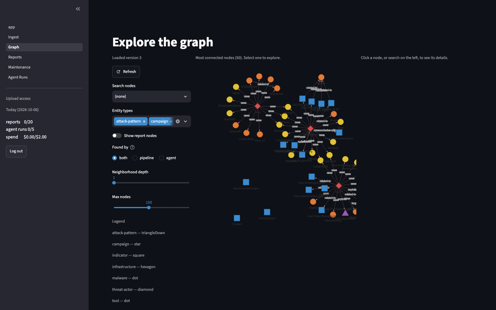
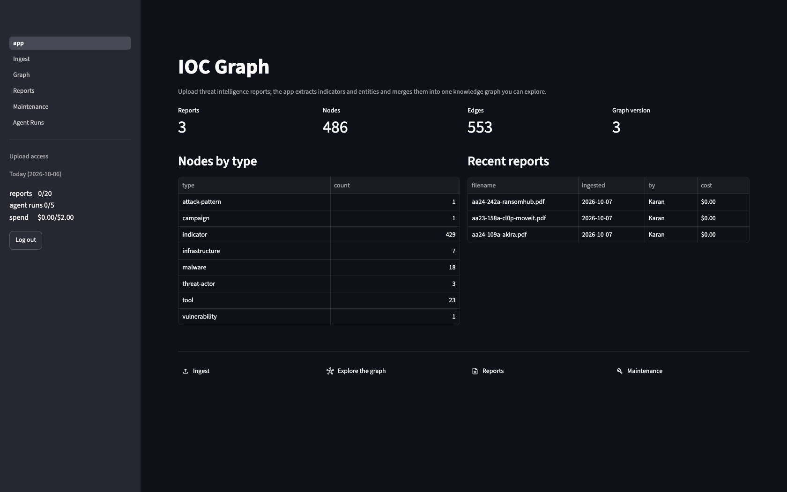
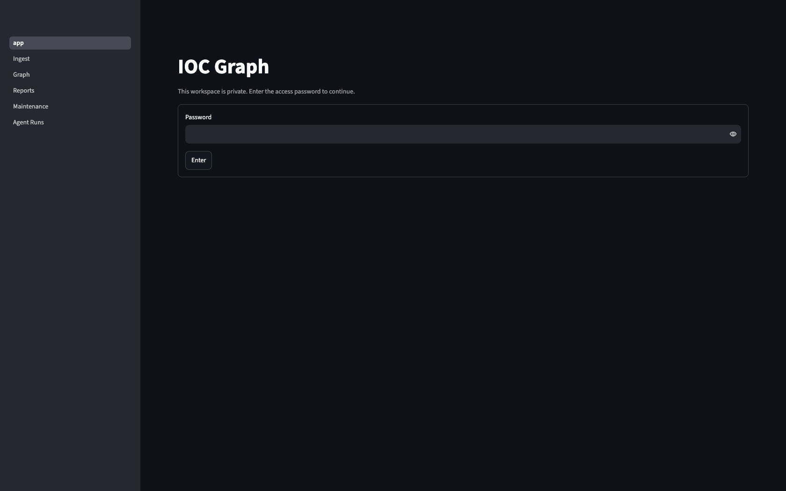
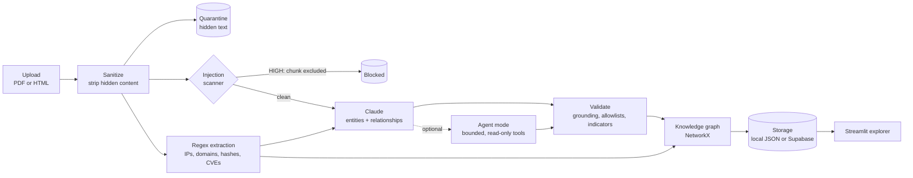

# IOC Graph

Upload a threat intelligence report and get a knowledge graph you can explore. The app pulls
indicators of compromise out of the document with regular expressions, asks Claude for the threat
entities and the relationships between them, **verifies every claim the model makes against the
source text**, and merges the result into one deduplicated graph that spans every report ingested
so far. Clicking a node shows what the entity is, how it is used, which indicators relate to it,
and the exact quotes that support each claim.

It is a portfolio project built around one idea: *an LLM reading attacker-authored documents is an
untrusted component, and so is its output.* Everything in the design follows from that.

> **Status: v1.0, all 7 phases complete.** Deployed access is by invitation — it is one shared
> workspace behind a password, running on the author's API key. The repository is private.

### The graph explorer



Three CISA advisories merged into one graph: 486 nodes, 553 edges. Entity type by colour and
shape, relationship labels on the edges, and indicators shown defanged (`hxxp://jirostrogud[.]com`)
so nothing on the canvas is a working link. Filters on the left control entity type, neighborhood
depth, node count, and whether an item was found by the pipeline or by agent mode.

### Home



Graph statistics, nodes by type, and recent reports with who ingested them and what each cost. The
sidebar carries the role badge and today's usage against the daily caps.

### The access gate



Nothing is visible without a password — verified: no node counts, graph version or entity names
appear before login, and a direct URL to any page returns this gate.

---

## What it does



Indicators come from regular expressions, never from the model. Entities and relationships come
from the model, but only survive if their evidence quote appears verbatim in the document. The
graph is the intersection of what the document says and what the model can prove.

## Features

- **Ingestion** of PDF (PyMuPDF text, pdfplumber tables) and HTML, with content-based type
  detection so a renamed file is rejected rather than misparsed.
- **Deterministic IOC extraction** with refanging (`hxxp://evil[.]com` → `http://evil.com`),
  normalization, deduplication across pages and tables, and false-positive flags for private IPs,
  version numbers, allowlisted domains and context-free hashes.
- **Hash repair** for the real-world case where a 64-character SHA-256 is wrapped across lines in a
  narrow table column. On one advisory this recovered 28 of 29 otherwise invisible hashes.
- **LLM entity extraction** with native structured outputs and a schema generated from the same
  Pydantic models that validate the response, so the two can never drift.
- **Grounding validation** — the core of the project. Quotes must be verbatim, indicator values must
  already have been found by regex, names must appear in the text, relationships must resolve.
  Every rejection is shown with a reason.
- **Knowledge graph** with normalization that merges `APT 21`, `APT-21` and `apt21` into one node,
  surfaces possible duplicates for human review, and never auto-merges on fuzzy similarity.
- **Interactive explorer** — click a node, see its neighborhood, relationships, indicators, source
  quotes and an optional grounded summary. Navigate by clicking relationships.
- **Layered guardrails** against prompt injection, with a 10-case poisoned test corpus and a benign
  control to prove the guardrails do not over-block.
- **Bounded agent mode** with four read-only tools, MITRE ATT&CK mapping against a local dataset,
  hard budgets, and a full step-by-step trace of every run.
- **Shared deployment** with view/upload passwords, daily caps on reports, agent runs and spend
  enforced race-free on both storage backends, and optimistic concurrency so two simultaneous
  uploads do not overwrite each other.

## Accuracy

Measured against three CISA advisories using their own published STIX IOC lists as ground truth.
Full methodology, per-type numbers and known limitations:
**[docs/EVALUATION.md](docs/EVALUATION.md)**.

| Advisory | Precision (flagged excluded) | Recall | Attainable recall |
| --- | --- | --- | --- |
| Akira (AA24-109A) | 0.967 | 0.513 | **1.000** |
| CL0P / MOVEit (AA23-158A) | 0.845 | 0.617 | 0.922 |
| RansomHub (AA24-242A) | 0.935 | 0.967 | 0.967 |

Plain recall looks low for a reason worth stating rather than hiding: a CISA STIX bundle lists
*every* hash of a file while the advisory PDF prints only one hash column, so many ground-truth
hashes are not in the document at all. **Attainable recall** measures only the entries actually
present in the text, and is the number that reflects the extractor. The IOC section was detected in
all three advisories.

## Security design

Full threat model, layer-by-layer design, poisoned-corpus results and limitations:
**[docs/SECURITY.md](docs/SECURITY.md)**.

Two things are untrusted: the **report**, because whoever uploads chooses the text the model reads,
and the **model's output**, because it is derived from that text. Four layers, built on the
assumption that each will eventually be evaded:

1. **Input sanitization.** Hidden content is quarantined before anything reads it — CSS-hidden
   elements, HTML comments, `aria-hidden`, hiding classes, white-on-white text, sub-4pt PDF spans,
   off-page spans. Quarantined text is excluded from regex extraction *and* the model, because
   hidden text can plant a fake indicator as easily as a fake instruction. A heuristic scanner then
   excludes chunks carrying high-severity injection patterns.
2. **Prompt structure.** Report text is wrapped in `<report-{nonce}>` with 8 random hex characters
   per request, so the delimiter cannot be predicted or closed. The untrusted-data rule appears
   before *and* after the report block. The model gets no tools at all in pipeline mode.
3. **Output validation.** Verbatim grounding, the indicator allowlist, name presence, relationship
   integrity — and the model's own output is itself scanned for injection.
4. **Least privilege.** No write tools, ever. Nothing opens, fetches or executes anything found in
   a report. No untrusted text reaches `st.markdown`, `st.write`, `st.html` or `unsafe_allow_html`,
   and a test fails the build if any appears.

**The layer doing the real work is output validation**, not the injection scanner. The scanner is a
heuristic whose patterns are public in this repository and can be rephrased around. But a successful
injection still has to produce an entity whose evidence is a verbatim quote from the document and
whose indicators were found independently by regex.

Ten poisoned reports (`tests/poisoned/`, generator committed) cover visible and hidden injection,
delimiter escape, fake-indicator planting, markdown exfiltration and a bad relation type. All ten
behave as expected, and a **benign control** is included because a guardrail suite that only proves
it blocks things has not shown it avoids blocking everything.

## Agent mode

An **optional** deep analysis on top of the pipeline, which stays the default. Four tools, all
read-only: `search_report`, `lookup_attack`, `query_graph`, and `submit_findings` as the only way to
end the loop. There is deliberately no write tool in `agent/tools.py`, so "the model decided to save
something" is not a reachable state — a test asserts no storage write happens during a run.

**Three hard budgets**, because an agent loop without a ceiling is an unbounded bill: 8 tool calls,
60,000 cumulative input tokens, 120 seconds. Whichever is reached first triggers one final "submit
now" message; if the model still does not submit, the run ends `no_submission` and the pipeline
result is kept. The loop always terminates in a defined status.

ATT&CK technique ids are checked against a local dataset and the technique *name* comes from that
dataset rather than the model, so the graph cannot hold a real-looking id with an invented name.
Tool results are nonce-wrapped and injection-scanned, since `search_report` returns report text and
is exactly as hostile as the report.

**Measured honestly:** across 9 runs (3 per fixture), ATT&CK recall on one advisory ranged from
**0.000 to 0.824 for identical inputs**, and 3 of 9 runs submitted nothing at all. Agent mode is a
*sometimes* improvement, not a reliable one, which is why it stays opt-in and why an empty
submission retains the pipeline result rather than replacing it. Numbers and interpretation:
[docs/EVALUATION.md](docs/EVALUATION.md).

## How IOC extraction works

Entirely deterministic: regular expressions, no model, no network. The same report always yields
the same indicators.

1. **Collect sources.** Each page's text and each table's cells are searched separately, so an
   indicator can be attributed to a page. IOC lists in advisories are almost always tables.
2. **Repair the text.** Advisories wrap long hashes across lines in narrow columns.
   `extract/text_repair.py` rejoins fragments, but only when they divide cleanly into whole hashes,
   so two stacked SHA-256 hashes are never merged into a SHA-512 that was never in the report.
3. **Refang.** `hxxp://evil[.]com`, `bad(.)org`, `evil[dot]net` and `user[at]evil[.]com` become real
   indicators before matching.
4. **Extract.** `ioc-finder` for IPs, domains, URLs, emails, CVEs, MD5, SHA-1 and SHA-256;
   `iocextract` for SHA-512 only, which `ioc-finder` does not support.
5. **Normalize.** Domains and hashes lowercased, CVE ids uppercased, IPs canonicalized through
   `ipaddress` (which also rejects invalid ones), URL scheme and host lowercased with the path's
   case preserved.
6. **Deduplicate** by type and value, merging pages, counts and every original spelling. A domain
   that only ever appears as the host of an extracted URL is not reported separately.
7. **Flag likely false positives** without dropping them: private, loopback, reserved and
   documentation IP ranges; dotted quads next to version wording; allowlisted and publisher-owned
   domains; filename-like TLDs; context-free hashes.

Indicators are displayed **defanged** so nothing in the UI is a working link and a copied value is
not immediately dangerous. Real values leave only through the labelled download buttons.

## How LLM extraction is validated

The model proposes; application code decides. In `extract/validate.py`, every item must pass:

1. **Schema** — Pydantic. Types outside the STIX allowlists never get further. A malformed response
   is retried exactly once with the error described, then dropped.
2. **Text safety** — HTML tags and markdown link/image syntax stripped from every string.
3. **Grounding** — the `evidence` quote must appear verbatim in the chunk. Comparison tolerates what
   PDFs break (line breaks mid-sentence, curly quotes, en dashes, hyphenation across lines, case)
   but not changed wording, so a paraphrase still fails.
4. **Indicator check** — an `indicator` entity must match a value regex extraction already found.
5. **Name presence** — the name or an alias must appear in the text.
6. **Relationship integrity** — both endpoints must resolve to a kept entity or known indicator.
7. **Injection in output** — the model's own strings are scanned; names with URLs or newlines are
   rejected; residual markup is treated as failure.

Every drop is recorded with a reason code and shown in the app's validation panel, so the guardrails
are visible rather than implied. A chunk losing more than half its items is flagged suspicious.

**Cost control.** No API call without a button click, and the worst-case cost is shown first. Only
the highest-priority chunks are sent — IOC-section pages, then pages with indicators or ATT&CK ids —
capped at `MAX_CHUNKS_PER_REPORT`, with the number skipped reported. Results are cached by file hash,
model and prompt version, so re-analysing the same report makes no call and costs nothing.

## Exploring the graph

Every analysed report merges into one graph, so an entity named in three advisories is **one node
with three sources**, not three nodes.

**Deduplication** happens on a normalized key: `APT 21`, `APT-21` and `apt21` all key to `apt21`;
CVE ids are case-normalized; an ATT&CK technique is keyed by its id. Normalization only collapses
*mechanical* differences. It never merges two names because they look similar — similar pairs are
listed on the Maintenance page for a human to judge, and a real merge is recorded by editing
`graph/aliases.json`. Automatic fuzzy merging would eventually merge two genuinely different threat
actors, which is a worse failure than a duplicate node.

**The view is always a neighborhood**, never the whole graph, because past a few hundred nodes a
full graph is an unreadable hairball. Clicking a node in the canvas, or a relationship in the detail
panel, navigates to it, and a breadcrumb tracks where you have been.

**Summaries are generated only on click**, from that node's evidence quotes alone, and cached against
a hash of those quotes — if a later report adds evidence, the summary is marked outdated rather than
silently presented as current.

**Storage** is behind a `GraphStore` interface. Writes are atomic (temp file, fsync, `os.replace`)
so an interrupted save cannot truncate the graph, with the last five versions kept as restorable
backups. Saves use an optimistic version number: if the stored version changed since load, the save
is rejected and the app reloads and re-merges onto the newer graph rather than overwriting someone
else's upload. Merging is idempotent, which is what makes that retry safe.

## Local setup

Requires Python 3.11+.

```bash
python3 -m venv .venv
source .venv/bin/activate
pip install -r requirements.txt

cp .env.example .env        # then edit .env and add your Anthropic API key
pre-commit install          # installs the gitleaks secret-scanning hook

streamlit run app.py        # start the app
pytest                      # 388 tests, no API calls, costs nothing
```

Optional, for agent mode (downloads ~38 MB of MITRE ATT&CK data, gitignored):

```bash
python scripts/fetch_attack.py
```

Reproducing the evaluation (downloads public CISA advisories, also gitignored):

```bash
python scripts/fetch_fixtures.py            # download the advisories
python scripts/build_expected.py            # rebuild the committed ground truth
python scripts/eval_regex.py                # print regex extraction metrics
python scripts/compare_modes.py --dry-run   # cost estimate for pipeline vs agent
```

## Deployment

One shared workspace on Streamlit Community Cloud with Supabase storage, gated by two passwords.
Step-by-step instructions and a smoke-test checklist: **[docs/DEPLOY.md](docs/DEPLOY.md)**.

Supabase rather than local files because Streamlit Community Cloud wipes the container disk on every
restart — local JSON would survive until the first reboot and then take every ingested report with
it. Row Level Security is enabled on every table with **no policies**, so only the server-side
service-role key can reach the data and a leaked anon key is harmless.

**Uploaded files are never stored** — not on disk, not in Supabase. They are parsed in memory and
discarded; only extracted results and metadata persist.

## Configuration

All settings come from `.env` locally, or `st.secrets` when deployed (environment takes precedence).
See `.env.example` and `.streamlit/secrets.toml.example`.

| Variable | Default | Purpose |
| --- | --- | --- |
| `ANTHROPIC_API_KEY` | none | API key. Required for entity extraction onward |
| `ANTHROPIC_MODEL` | `claude-haiku-4-5-20251001` | Model used for extraction |
| `ANTHROPIC_AGENT_MODEL` | same as above | Model used by agent mode |
| `STORAGE_BACKEND` | `local` | `local` for JSON in `data/`, `supabase` when deployed |
| `MAX_FILE_MB` / `MAX_PAGES` | `5` / `50` | Upload limits |
| `MAX_CHUNKS_PER_REPORT` | `6` | Chunks per report sent to the model; the main cost control |
| `MAX_OUTPUT_TOKENS` | `4000` | Output budget per chunk |
| `INJECTION_BLOCK_ON` | `high` | `high`, `medium` (over-blocks) or `none` (report only) |
| `INJECTION_CLASSIFIER` | `none` | Hook for a model-based classifier; only `none` implemented |
| `AGENT_MAX_TOOL_CALLS` | `8` | Hard ceiling on agent tool calls |
| `AGENT_MAX_INPUT_TOKENS` | `60000` | Hard ceiling on cumulative agent input tokens |
| `AGENT_MAX_SECONDS` | `120` | Hard wall-clock ceiling per agent run |
| `SUPABASE_URL` / `SUPABASE_SERVICE_KEY` | none | Required when `STORAGE_BACKEND=supabase` |
| `VIEW_PASSWORD` / `UPLOAD_PASSWORD` | none | Access control. **Both unset means the app is open** |
| `DAILY_REPORT_LIMIT` | `20` | Reports per day |
| `DAILY_AGENT_LIMIT` | `5` | Agent runs per day |
| `DAILY_SPEND_LIMIT_USD` | `2.00` | Estimated spend per day |
| `APP_TIMEZONE` | `America/Toronto` | When the daily caps reset |

## Project layout

```text
app.py              Home page and entry point
auth.py             Shared-password access control, view and upload roles
usage.py            Daily caps: reserve before the call, settle after
config.py           Settings and on-demand secret access
ingest/             PDF and HTML text extraction, upload validation
extract/            IOC extraction and LLM extraction
  iocs.py           Regex extraction, normalization, dedup, FP flags
  text_repair.py    Rejoins hashes wrapped across lines by PDF layout
  schema.py         The schema the LLM must return
  prompts.py        Nonce delimiters and untrusted-data instructions
  validate.py       Grounding, indicator and integrity checks
  llm_extract.py    Orchestration, merging, caching, cost tracking
guards/             The four guardrail layers
  sanitize_html.py  Removes hidden content
  sanitize_pdf.py   Quarantines tiny, white and off-page spans
  injection.py      Heuristic injection scanner with a HIGH/MEDIUM policy
agent/              Bounded agent mode: ATT&CK data, read-only tools, the loop
graph/              Graph model, normalization, idempotent merge, summaries
storage/            GraphStore interface, local JSON and Supabase backends
pages/              Ingest, Graph, Reports, Maintenance, Agent Runs
supabase/schema.sql Tables, RPC functions and the RLS configuration
scripts/            Fixture download, ground truth, evaluation, migration
tests/              388 tests including the poisoned corpus
docs/               SECURITY.md, EVALUATION.md, DEPLOY.md
```

## Security practices in this repo

Secrets live only in `.env` and `.streamlit/secrets.toml`, both gitignored and never committed. No
secret is a field on the settings object: each is read on demand by a function, so it cannot be
captured in a `repr`, a log line or Streamlit session state, and a test asserts the settings object
contains no secret values. A `pre-commit` hook runs [gitleaks](https://github.com/gitleaks/gitleaks)
on every commit, verified by generating a fake key in the real Anthropic format and confirming the
commit was blocked. A full-history gitleaks scan is clean.

## Limitations

Stated plainly, because a security project that hides its weak points is not making a security
argument.

- **The injection scanner is a heuristic and is evadable.** Its patterns are in this repository. It
  is one layer of four and not the one carrying the argument.
- **The PDF colour heuristic compares against white, not the rendered background.** White-on-white
  is caught; white text over a dark image is a false positive (quarantined, not deleted);
  black-on-black is missed.
- **External CSS is not evaluated** — only inline styles.
- **URLs wrapped across lines are still lost** (4 of 110 on one advisory). Unlike hashes they have
  no fixed length to validate a rejoin against, and guessing would invent URLs.
- **Code and query identifiers can read as domains** — `f.id` from a SQL snippet, because `.id` is a
  real TLD.
- **The 5-attempt lockout is per session**, so it can be bypassed by opening a new one. Accepted for
  a link shared with a few trusted people, and bounded by the daily caps.
- **No per-user accounts.** One shared workspace, one shared password per role.
- **Prices are a local table** (`llm/pricing.py`), verified 2026-10-06. They need updating when
  Anthropic changes pricing, or cost reporting drifts.

## Roadmap

- Per-user accounts and profiles, so the graph can record who contributed what.
- External enrichment (VirusTotal, AbuseIPDB, URLhaus) as additional read-only agent tools.
- STIX 2.1 bundle export, so the graph can feed a real threat intelligence platform.
- A rendering-based PDF hidden-text detector, the correct fix for the colour heuristic.
- A model-based injection classifier behind the existing `INJECTION_CLASSIFIER` hook.
